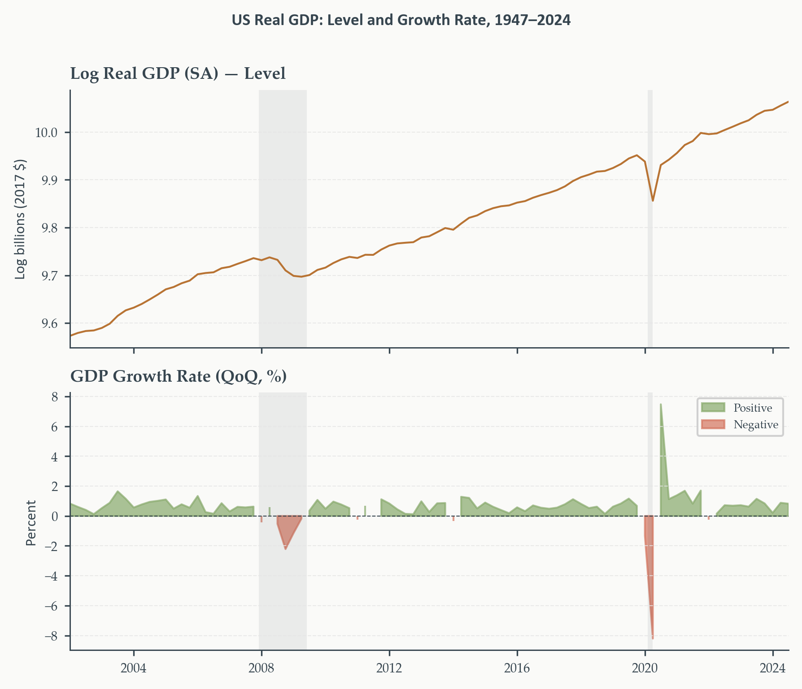
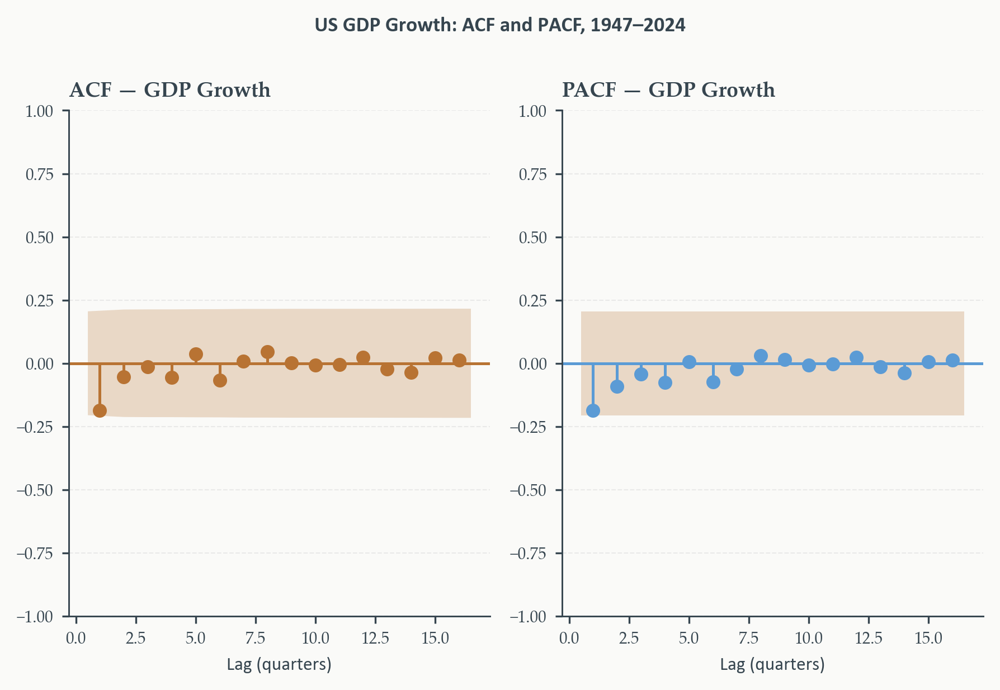
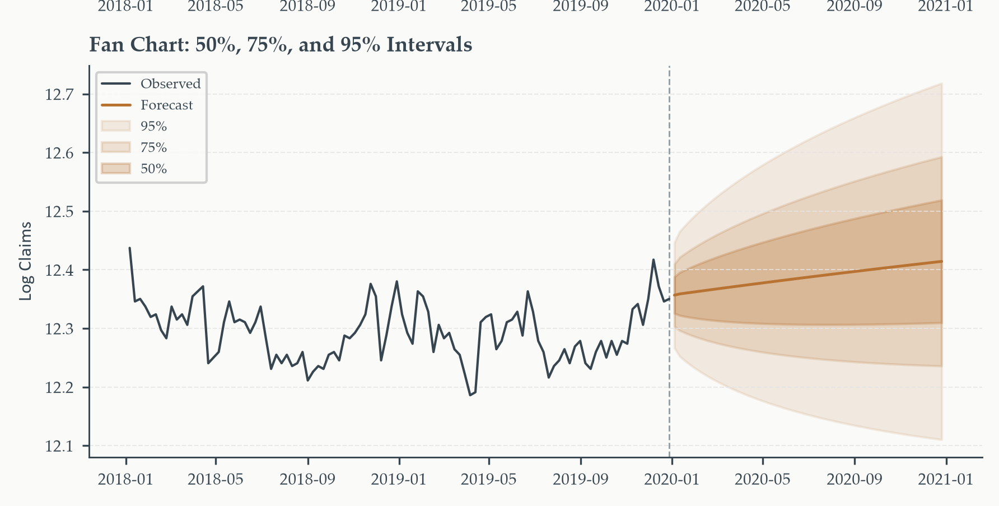
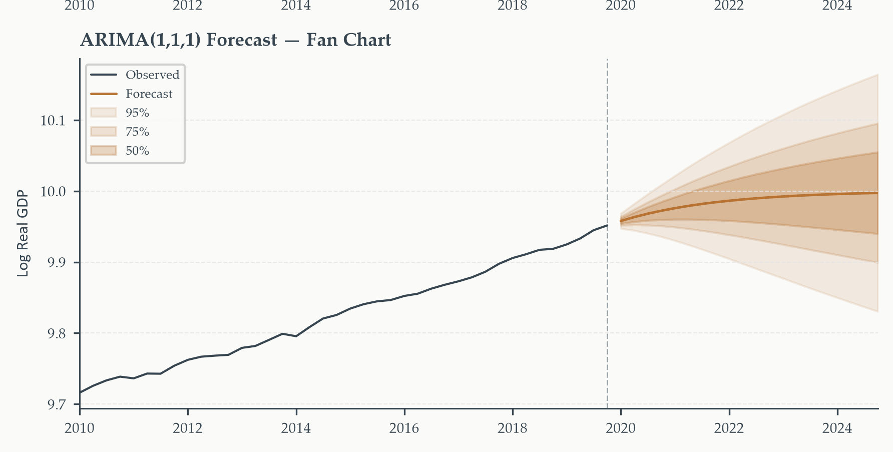
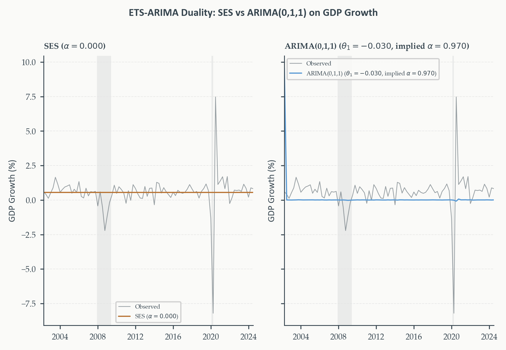
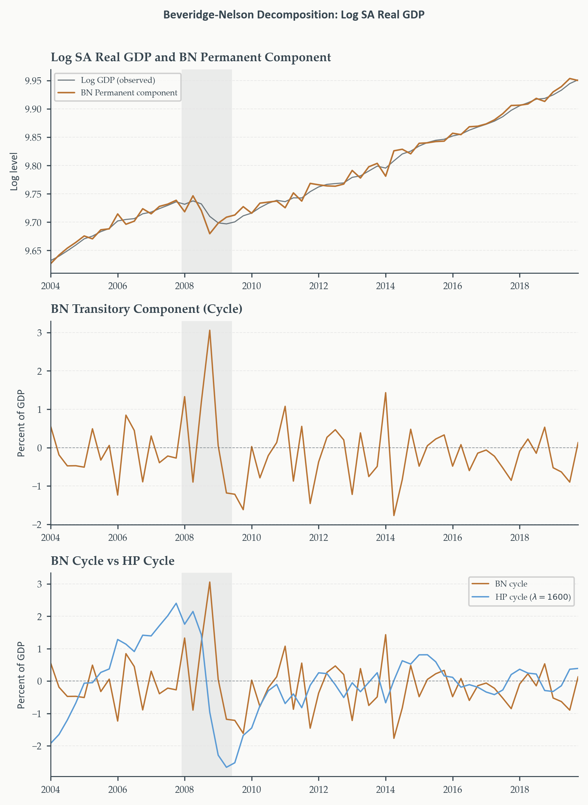

## What Survives When Stationarity Fails?

> Chapter 3 built an entire toolkit — ACF, Yule-Walker, MLE, mean-reverting forecasts — on one assumption: every characteristic root strictly inside the unit circle. What happens exactly at the boundary?

- Not a hypothetical edge case — Chapter 1 already established that log real GDP is $I(1)$
- We deferred the question; we did not make it disappear
- At $\phi_1=1$: the ACF stops decaying, Yule-Walker becomes ill-defined, the standard MLE likelihood no longer applies, forecasts stop reverting and start drifting

::: {.eo-recap}
This chapter is the direct answer. Not a patch on Chapter 3 — a systematic extension that builds the differencing operator directly into the model, deepens the testing machinery from Chapter 1, and along the way resolves two questions the course has left open: Chapter 2's ETS-ARIMA connection, and Chapter 2's trend-cycle decomposition problem.
:::

::: {.notes}
Open here. This is explicitly a "the bill comes due" chapter — every
forward-pointer from Chapters 1-3 about deferred stationarity issues gets
paid off here. Worth naming that explicitly. ~2 min.
:::

---

## Why This Chapter Matters

Two deferred threads, two new extensions, two resolved questions:

1. **Deferred**: what a unit root actually breaks, and the deepened testing toolkit to detect one properly
2. **New**: ARIMA and SARIMA — building differencing directly into the Box-Jenkins framework
3. **Resolved**: the ETS-ARIMA duality (Chapter 2) and a model-based trend-cycle decomposition (Chapter 2's filters) via Beveridge-Nelson

::: {.eo-recap}
Running example throughout: US real GDP — the series followed since Chapter 1, now finally modeled the way its own diagnostics have been telling us to since the beginning.
:::

---

## Today's Roadmap {.outline-slide}

1. Integration and stochastic trends
2. Deepening unit root testing
3. The ARIMA model
4. ARIMA forecasting
5. SARIMA
6. The ETS-ARIMA duality
7. The Beveridge-Nelson decomposition

---

## Integration and Stochastic Trends {.section-divider background-color="#B87333" footer=false}

::: {.eo-section-label}
Section 1
:::

---

## From Stationarity to the Unit Root

> Chapter 3's entire framework requires every characteristic root strictly inside the unit circle. What happens exactly at the boundary — not $\phi_1=0.98$, but $\phi_1=1$?

Start from the AR(1) and let $\phi_1\to1$. Recall the stationary variance: $\sigma^2/(1-\phi_1^2)$.

::: {.eo-hazard}
**The variance explodes at the boundary.** As $\phi_1\to1$, $(1-\phi_1^2)\to0$ and the unconditional variance diverges. A unit root process has **no finite unconditional variance** — the entire apparatus of Chapter 3 (ACF, Yule-Walker, MLE) was built assuming this quantity exists.
:::

---

## What Actually Breaks

| Chapter 3 tool | What happens at $\phi_1=1$ |
|:---|:---|
| ACF | Does not decay — stays near 1.0 for dozens of lags |
| Yule-Walker | $\mathbf{R}$ becomes singular; the system is no longer well-defined |
| MLE likelihood | Standard asymptotic theory (Section 3.6) no longer applies |
| Forecasts | Stop mean-reverting; start drifting instead |

::: {.eo-recap}
Every one of these failures traces back to the same root cause: the process no longer has a fixed point to revert to. $\text{Var}(y_t)=t\sigma^2$ grows without bound — the exact random-walk result from Chapter 1, now understood as the boundary case of everything Chapter 3 built.
:::

---

## Integration Order: $I(0)$, $I(1)$, $I(2)$

::: {.eo-definition}
**Integration order.** $y_t\sim I(d)$ if $\Delta^d y_t$ is covariance-stationary but $\Delta^{d-1}y_t$ is not. $I(0)$: stationary in levels. $I(1)$: first difference stationary — the overwhelming majority of economic level series.
:::

$$
\Delta^2 y_t = \Delta y_t - \Delta y_{t-1}
$$

::: {.eo-hazard}
$I(2)$ appears occasionally — some long-sample nominal price or interest rate series — but is rare. **Economic reasoning should guide the choice before formal testing**: a growing trend in *growth rates* is implausible over long horizons for something like GDP, so $I(2)$ is not a serious candidate there regardless of what a test might suggest in a short or unusual sample.
:::

---

## The Simplest Unit Root Case: The Algebra

Start from the random walk with drift — the AR(1) at exactly $\phi_1=1$:

$$
y_t = y_{t-1}+\mu+\varepsilon_t
$$

Rearrange to isolate the change in $y_t$:

$$
y_t - y_{t-1} = \mu+\varepsilon_t
$$

In lag operator notation, $y_{t-1}=Ly_t$, so $y_t-y_{t-1}=(1-L)y_t$:

$$
(1-L)y_t = \mu+\varepsilon_t \qquad \text{ARIMA(0,1,0)}
$$

::: {.eo-recap}
**What differencing recovers.** The left side is exactly $\Delta y_t$ — Chapter 1's difference operator. Once differenced, this is nothing more than $\Delta y_t = \mu+\varepsilon_t$: a constant plus white noise, **stationary by construction**. Differencing didn't just simplify the notation — it turned an unbounded-variance process back into one Chapter 3's entire toolkit applies to directly.
:::

---

## Drift and No-Drift: What It Means for Forecasts

$$
\Delta y_t = \mu+\varepsilon_t \qquad\Longleftrightarrow\qquad (1-L)y_t=\mu+\varepsilon_t
$$

**No drift** ($\mu=0$): the level forecast is **flat** at $y_T$ for every horizon — the best guess of tomorrow, and of ten years from now, is simply "wherever we are today." Intervals still widen with $h$.

**With drift** ($\mu\neq0$): the level forecast **grows linearly** at rate $\mu$ per period — $\hat y_{T+h|T}=y_T+h\mu$. Intervals widen around that trend line, not around a fixed level.

::: {.eo-recap}
$d=1$ means **one** unit root — one application of $\Delta$ produces stationarity. This is deliberately the simplest possible ARIMA specification, previewing Section 3's general framework before any AR or MA structure is added.
:::

---

## Spurious Regression: The Obvious Case

> If we regress one $I(1)$ series on another — even two completely unrelated random walks — what does OLS find?

::: {.eo-definition}
**Spurious regression** (Granger and Newbold, 1974). Regressing one $I(1)$ series on an unrelated $I(1)$ series produces $t$-statistics and $R^2$ that **diverge as $T\to\infty$** rather than converging to their true (zero) values. Standard inference fails completely.
:::

Tyler Vigen's *Spurious Correlations*: annual Nicolas Cage film appearances vs. swimming pool drownings, $r=0.67$ over thirteen years. Self-evidently absurd — yet the regression returns $t>2$, $p<0.05$, a publication-plausible $R^2$.

::: {.eo-recap}
The mechanism: two independent series that both **drift** will appear correlated in any finite sample, purely by construction — nothing about their content matters.
:::

---

## Spurious Regression: The Plausible Case

> The Cage/drownings case is obviously absurd. What does the same failure look like when it's dressed as real economics?

Regress log CPI on log real GDP — both $I(1)$, both trend upward, both central to macroeconomic analysis. OLS returns a highly significant positive relationship.

::: {.eo-hazard}
**This relationship is not structural.** The price level and real output are jointly determined by monetary policy, demand shocks, and supply conditions. Regressing one on the other in levels — without accounting for their shared stochastic trends — is exactly as spurious as the Cage/drownings case. The difference is that this one *looks* like serious economics, which is precisely why it's dangerous.
:::

---

## The General Lesson

::: {.eo-recap}
**Spurious regression is not detectable from the output alone.** A large $t$-statistic, a significant $p$-value, a respectable $R^2$ — none of it distinguishes a genuine relationship from two series that merely happen to trend the same direction.
:::

**The only protection**: test for unit roots *before* estimating any regression involving level variables.

Chapter 8's cointegration framework asks the deeper question properly — do two $I(1)$ series share a genuine common trend, rather than just coincidental drift?

---

## Deepening Unit Root Testing {.section-divider background-color="#B87333" footer=false}

::: {.eo-section-label}
Section 2
:::

---

## Refresher: The ADF Regression

::: {.eo-definition}
**ADF regression** (Chapter 1). Built on the AR(1) rewritten as $\Delta y_t=\delta y_{t-1}+c+\varepsilon_t$, $\delta=\phi-1$. Augmented with lagged differences to absorb serial correlation:

$$
\Delta y_t = \delta y_{t-1} + \sum_{j=1}^p\psi_j\Delta y_{t-j} + \alpha+\beta t + u_t
$$
:::

$H_0:\delta=0$ (unit root) vs. $H_1:\delta<0$ (stationary) — one-sided. Test statistic: the $t$-ratio on $\hat\delta$, compared against the left-skewed **Dickey-Fuller distribution**, not a standard $t$.

::: {.eo-recap}
$\alpha,\beta$ are the deterministic terms — constant and trend. Which to include is exactly the specification question the next few slides deepen.
:::

---

## Refresher: The KPSS Statistic

::: {.eo-definition}
**KPSS decomposition** (Chapter 1). $y_t=\xi t+r_t+\varepsilon_t$, where $r_t=r_{t-1}+u_t$ is a random walk. $H_0:\sigma_u^2=0$ (stationary around the deterministic part) vs. $H_1:\sigma_u^2>0$ (unit root) — the reverse of ADF.
:::

Let $\hat\varepsilon_t$ be OLS residuals from the deterministic part, and $S_t=\sum_{s=1}^t\hat\varepsilon_s$ their partial sum:

$$
\text{KPSS} = \frac{1}{T^2}\frac{\sum_{t=1}^T S_t^2}{\hat\lambda^2}
$$

::: {.eo-recap}
**Rejection rule reversed vs. ADF.** A **large** KPSS statistic rejects stationarity — large values mean $S_t$ drifts systematically, the signature of a unit root. $\hat\lambda^2$ is the long-run variance estimator — its own specification question, developed shortly.
:::

---

## From Data Characterization to Model Specification

> Chapter 1 ran ADF and KPSS to establish basic facts about a series before modeling began. Now they're doing different work — what changed?

Same two tests, same null hypotheses — but now every specification choice inside them determines what model gets built next: whether to difference, how many lags, whether a trend belongs in the deterministic component.

::: {.eo-recap}
**Choosing deterministic terms.** Under $H_0$ (unit root), a constant produces a random walk with drift; a trend term produces a *quadratic* trend — rarely plausible for economic data. Include only what's plausible under $H_1$: log GDP trends upward, so constant-and-trend is appropriate; GDP growth fluctuates with no visible trend, so constant-only is the right choice. A trend term the data don't support just costs power.
:::

---

## Choosing the Lag Length: Two Approaches

> The augmentation lags in the ADF regression exist for one purpose — absorbing serial correlation so the test statistic has its correct distribution. Too few: the test over-rejects. Too many: it under-rejects. How do we choose?

::: {.eo-definition}
**Information criteria (IC).** Fit ADF for $p=0,\ldots,p_{\max}$ (Schwert rule: $p_{\max}=\lfloor12(T/100)^{1/4}\rfloor$), minimize AIC or BIC. **BIC** tends toward more parsimonious lags with better size properties; **AIC** suits data with potentially complex serial correlation.
:::

::: {.eo-definition}
**General-to-specific (GTS).** Start at $p_{\max}$; test whether $\hat\psi_p$ is significant (10% common); if not, drop and retest at $p-1$; continue until significant or $p=0$. Tends to select **longer** lags than IC — better size, some cost to power.
:::

In practice, both methods usually agree for macroeconomic series of typical length. When they diverge substantially, checking robustness at both selected orders is good practice.

---

## The KPSS Long-Run Variance

> KPSS's statistic divides by an estimate of the long-run variance — why, and how sensitive is the result to that choice?

Without correcting for serial correlation, positively autocorrelated residuals would inflate the KPSS statistic and spuriously reject stationarity. The **Newey-West** estimator corrects for this:

$$
\hat\lambda^2 = \hat\gamma(0)+2\sum_{j=1}^l\left(1-\frac{j}{l+1}\right)\hat\gamma(j)
$$

::: {.eo-recap}
**The bandwidth tradeoff.** $l$ too small: serial correlation uncorrected, statistic inflated, spurious rejection. $l$ too large: estimator variance increases, power falls. The automatic rule $l=\lfloor4(T/100)^{1/4}\rfloor$ balances both for typical sample sizes — but because results can be sensitive to this choice, checking robustness across two or three bandwidths is standard practice.
:::

---

## The Joint Testing Strategy, Revisited

Chapter 1's four-outcome table, now with the richer explanation each disagreement case deserves:

| ADF | KPSS | Conclusion |
|:---|:---|:---|
| Reject | Fail to reject | Stationary — model as ARMA |
| Fail to reject | Reject | Unit root — difference, model as ARIMA |
| Reject | Reject | Near-integrated **or structural break** |
| Fail to reject | Fail to reject | Insufficient evidence |

::: {.eo-hazard}
**When both tests reject, suspect a structural break first.** A mean or trend shift can make a series look stationary to ADF in a local window while still looking nonstationary to KPSS overall. Chapter 1's inflation example was exactly this: pre-1979 looked like a unit root, post-1983 looked stationary — pooling the full sample produced contradictory results because the data-generating process itself had changed. Chapter 6 develops formal structural break testing.
:::

---

## A More Powerful ADF: Elliott-Rothenberg-Stock

> The standard ADF has low power against near-integrated alternatives — $\phi_1=0.97$ is technically stationary, but ADF often fails to reject the unit root null at typical macroeconomic sample lengths. Is there a more powerful version?

::: {.eo-definition}
**ERS (GLS-detrended ADF).** Removes deterministic components by **GLS** rather than OLS before applying the ADF regression — accounting for the autocorrelation structure under the null, rather than ignoring it. Approaches the Gaussian power envelope: the best possible power against near-integrated alternatives for any test in this class.
:::

::: {.eo-recap}
**Where OLS "wastes" information, GLS uses it.** OLS detrending doesn't account for serial correlation, so the estimated trend absorbs variation that should belong to the stochastic component — reducing power. GLS pre-whitens first, shrinking the ambiguous zone between "clearly $I(1)$" and "clearly $I(0)$." Standard practice: run the standard ADF first; reach for ERS when the result is borderline (roughly $0.05<p<0.15$) and the economic prior on integration order isn't already clear.
:::

---

## Applied: Full Testing on Log SA GDP

::: {.eo-columns-figure}
::: {}
Same visual signature Chapter 1 established: the level drifts persistently with no fixed attractor; the growth rate fluctuates around a stable positive mean.

This guides specification directly: constant-and-trend for the level, constant-only for growth.
:::
::: {}
{fig-alt="Log SA real GDP level and its first difference (growth rate), 1947-2024, with NBER recessions shaded"}
:::
:::

---

## Applied: The Result

::: {.eo-recap}
**Both AIC and BIC lag selection agree.** The level's ADF statistic sits far from its critical values, $p$ well above conventional thresholds — the unit root null is **not rejected**.

Growth, tested with constant-only, tells the opposite story — the null **is** rejected.
:::

Together: log GDP is $I(1)$, exactly as Chapter 1 established — now with the full specification procedure behind that conclusion, not just a quick check.

---

## The ARIMA Model {.section-divider background-color="#B87333" footer=false}

::: {.eo-section-label}
Section 3
:::

---

## Building Differencing Into the Model

> Chapter 3's entire Box-Jenkins workflow assumed stationarity. Section 1 showed differencing recovers stationarity from a unit root series. Why not build that step directly into the model specification?

::: {.eo-definition}
**ARIMA($p$,$d$,$q$).**

$$
\phi_p(L)\,(1-L)^d\,y_t = \mu^*+\theta_q(L)\varepsilon_t, \qquad \varepsilon_t\sim WN(0,\sigma^2)
$$

$\phi_p(L)$: stationary AR component. $(1-L)^d$: $d$ unit roots — the integration. $\theta_q(L)$: invertible MA component.
:::

**Special cases**: ARIMA(0,1,0) is the random walk from Section 1. ARIMA($p$,0,$q$) is exactly Chapter 3's stationary ARMA($p$,$q$). ARIMA(0,$d$,0) is a pure $I(d)$ process with no ARMA structure at all.

---

## The Same Model, Two Views

For $d=1$, let $w_t=\Delta y_t$. Then:

$$
\phi_p(L)\,w_t = \mu^*+\theta_q(L)\varepsilon_t
$$

::: {.eo-recap}
**This is exactly Chapter 3's ARMA($p$,$q$) — for $w_t$.** ARIMA($p$,1,$q$) on $y_t$ and ARMA($p$,$q$) on $\Delta y_t$ are the **same model**, written in terms of different variables. The entire Box-Jenkins workflow — identification, MLE, Ljung-Box, information criteria — carries over unchanged. Only two things are genuinely new: determining $d$ before the workflow begins, and reconstructing level forecasts at the end.
:::

---

## Why Difference Rather Than Add a Trend?

> Log GDP looks like a straight line. Why not just add $\beta t$ to an ARMA model instead of differencing?

The answer is exactly Chapter 1's trend-stationary vs. difference-stationary distinction, now with consequences for model-building specifically:

- **Trend-stationary** ($y_t=\alpha+\beta t+u_t$, $u_t$ stationary): shocks are transitory, the series returns to the line. Adding $\beta t$ to an ARMA is correct.
- **Difference-stationary**: no fixed trend to return to — each shock permanently shifts the level. Adding $\beta t$ **does not fix this**; the "trend" is itself stochastic.

::: {.eo-hazard}
**For log SA real GDP, Section 2 already settled this empirically.** ADF failed to reject the unit root null even with constant-and-trend; KPSS rejected stationarity. The series is difference-stationary — differencing is the correct treatment, not a trend term.
:::

---

## The ARIMA Workflow

::: {.eo-definition}
**Four steps**, extending Chapter 3's Box-Jenkins:

1. **Determine $d$** — ADF/KPSS on the level. Agree $I(1)$: set $d=1$. Disagree: suspect a structural break, not a pure unit root. Check $d=2$ only if $\Delta y_t$ is still visibly nonstationary
2. **Identify $(p,q)$** — ACF/PACF of $\Delta^dy_t$, Chapter 3's table. Include drift if the level trends. Seasonal spikes $\to$ Section 5
3. **Estimate and diagnose** — MLE on $\Delta^dy_t$, exactly Chapter 3, Section 6
4. **Forecast and reconstruct levels** — `statsmodels` handles this automatically with `order=(p,1,q)`
:::

::: {.eo-hazard}
**Overdifferencing.** If $y_t\sim I(1)$, $\Delta y_t\sim I(0)$ — correct. But $\Delta^2y_t$ is *also* stationary, with a root exactly at $z=-1$ in the MA polynomial — non-invertible, unreliable estimation, unnecessarily noisy forecasts. Difference exactly $d$ times, no more.
:::

---

## Applied: Identifying $(p,q)$ for GDP Growth

{fig-alt="ACF and PACF of quarterly US GDP growth, both showing a single significant negative spike at lag 1 and nothing beyond it"}

*A single significant spike at lag 1 in **both** ACF and PACF — negative, nothing else outside the band at any later lag. Neither function shows the clean, isolated cutoff of a pure AR or pure MA signature from Chapter 3's identification table; a lone matching spike in both is consistent with a small ARMA(1,1) or MA(1) term. The pattern alone doesn't settle it — information criteria, next, will need to resolve the final call.*

---

## Applied: Comparing Specifications by IC

Fitting ARIMA($p$,1,$q$) for $p,q\in\{0,\ldots,3\}$ on pre-COVID log SA GDP and ranking by BIC:

::: {.eo-recap}
**BIC and HQ favor parsimony** — likely a small model such as ARIMA(1,1,0) or ARIMA(0,1,1), consistent with the single lag-1 spike the ACF/PACF showed. **AIC may select a richer model.** `auto_arima` (stepwise, BIC) serves as a cross-check — when it agrees with the manual grid search, confidence is higher; small IC discrepancies between `pmdarima` and `statsmodels` are usually cosmetic (different constant-term and presample handling), not a real disagreement about model order.
:::

---

## auto_arima Is a Search Tool, Not a Black Box

::: {.eo-hazard}
**Three real limitations.** It inherits every limitation of the IC it's told to use — BIC favors parsimony and may miss real structure in small samples. Stepwise search is not exhaustive and can miss the global optimum. **Most importantly: it bypasses diagnostics entirely.** A model selected by `auto_arima` still needs residual ACF/PACF and Ljung-Box exactly as if hand-selected — treating the auto-selected output as a final answer without checking it is the most common misuse.
:::

::: {.eo-recap}
Use `auto_arima` to **generate candidates quickly**, then validate manually — never as a substitute for the Box-Jenkins workflow itself.
:::

---

## ARIMA Forecasting {.section-divider background-color="#B87333" footer=false}

::: {.eo-section-label}
Section 4
:::

---

## Forecasts Don't Mean-Revert Anymore

> Chapter 3's ARMA forecasts converged to $\hat\mu$ as $h\to\infty$ — mean reversion, a defining property of stationary models. What replaces it once $d=1$?

For the simplest case, ARIMA(0,1,0) with drift:

$$
\hat y_{T+h|T} = y_T+h\hat\mu
$$

::: {.eo-recap}
**Anchored to today, not to history.** The forecast is anchored to *where the series is right now* — $y_T$ — not to any unconditional mean, because none exists. A permanent shock shifts the entire forecast path permanently upward or downward; there's nothing pulling it back.
:::

---

## ARMA vs. ARIMA Forecasting: The Full Contrast

| Feature | ARMA (stationary) | ARIMA ($d=1$) |
|:---|:---|:---|
| Forecasts what? | Levels directly | Changes; levels by accumulation |
| Long-run forecast | Converges to $\hat\mu$ | Linear trend extrapolation |
| Interval width | Plateaus at $\sigma_y$ | Grows as $\sqrt{h}$, unbounded |
| Anchor | Unconditional mean | Current level $y_T$ |

::: {.eo-recap}
Every row traces back to the same root cause: a unit root process has no finite unconditional variance (Section 1) — so there's no fixed point for the forecast to revert to, and no ceiling for the interval to plateau against.
:::

---

## Reconstructing Levels from Differences

Since ARIMA($p$,1,$q$) on $y_t$ **is** ARMA($p$,$q$) on $\Delta y_t$ (Section 3), the model directly forecasts *changes* — cumulate from the last observed level to recover the level forecast:

$$
\hat y_{T+h|T} = y_T+\sum_{j=1}^h\hat{\Delta y}_{T+j|T}
$$

::: {.eo-recap}
`statsmodels`' `get_forecast()` does this automatically with `order=(p,1,q)` — output is already in level units. Fitting ARMA directly on $\Delta y_t$ instead means reconstructing manually: `y_T + fc_delta.cumsum()`, one line in Python.
:::

---

## Why Intervals Grow at $\sqrt{h}$, Not Faster

Each accumulated step in the sum above adds **independent** forecast uncertainty — nothing cancels, nothing bounds it. The standard deviation of the $h$-step level forecast error grows as $\hat\sigma_\Delta\sqrt{h}$.

::: {.eo-recap}
**The same $\sqrt{t}$ envelope from Section 1's random walk paths** — now understood as a general property of any $I(1)$ forecast, not just the special case of no ARMA structure at all. Doubling the horizon widens the interval by $\sqrt{2}\approx1.41$, not by 2 — growing, but not exploding.
:::

---

## Applied: ARIMA vs. ARMA Forecasts, Side by Side

::: {.eo-figure-pair}
{fig-alt="Chapter 3: ARMA(1,2) fan chart for log ICSA, showing the interval plateauing as the forecast converges to the unconditional mean"}
{fig-alt="Chapter 4: ARIMA fan chart for log SA real GDP, showing the interval widening without bound as the forecast extrapolates the trend"}
:::

*Left: Chapter 3's ARMA(1,2) forecast for log ICSA — the fan **plateaus** as the forecast converges to the unconditional mean. Right: this chapter's ARIMA forecast for log SA GDP — no plateau. The point forecast extrapolates the historical growth rate rather than reverting; by quarter 20, the interval has grown into a substantial range with nothing to bound it.*

::: {.eo-recap}
**Same visualization tool, two structurally different forecasts.** The shape difference is not a modeling artifact — it's the direct, visible consequence of Section 1's finding: a unit root process has no finite unconditional variance, so there's no ceiling for the interval to plateau against.
:::

::: {.notes}
Let the two panels do the talking — this is the chapter's central visual
payoff. ~2 min.
:::

---

## SARIMA {.section-divider background-color="#B87333" footer=false}

::: {.eo-section-label}
Section 5
:::

---

## Two Kinds of Seasonality

> Retail sales surge every December. Construction peaks every summer. Not random — genuine calendar-driven regularity. But does that regularity ever *change*?

**Deterministic seasonality**: a fixed, repeating pattern with **constant amplitude**. If December sales are always $k\%$ above average regardless of the state of the economy, seasonal dummy variables capture this exactly — anchored to specific calendar positions, never evolving.

**Stochastic seasonality**: the pattern's **amplitude itself drifts** over time — the Christmas peak stronger in booms, weaker in recessions.

::: {.eo-recap}
Dummies cannot capture stochastic seasonality — what's needed is a model where the seasonal pattern is itself an integrated process. That's exactly what SARIMA provides.
:::

---

## The Seasonal Difference Operator

For a series observed $s$ times per year (quarterly: $s=4$; monthly: $s=12$):

$$
\Delta_s = 1-L^s, \qquad \Delta_sy_t = y_t-y_{t-s}
$$

For quarterly data, $\Delta_4y_t=y_t-y_{t-4}$ compares this quarter to the **same quarter last year** — removing the annual pattern directly.

::: {.eo-recap}
**The unit-circle picture, extended.** $1-L^s$ has $s$ roots of unit modulus, evenly spaced around the unit circle at angles $2\pi k/s$. Seasonal differencing removes all $s$ of these simultaneously — the exact same logic as regular differencing removing the single unit root at $z=1$, now applied at every seasonal frequency at once.
:::

---

## The SARIMA Model: Expanded Form

Two differencing operations: seasonal first, then regular. Define the doubly-differenced series $w_t=\Delta_4\Delta y_t$:

$$
\begin{aligned}
w_t = \mu^*
&+\underbrace{\phi_1w_{t-1}+\cdots+\phi_pw_{t-p}}_{\text{non-seasonal AR}(p)}
+\underbrace{\Phi_1w_{t-4}+\cdots+\Phi_Pw_{t-4P}}_{\text{seasonal AR}(P)} \\
&+\underbrace{\varepsilon_t+\theta_1\varepsilon_{t-1}+\cdots}_{\text{non-seasonal MA}(q)}
+\underbrace{\Theta_1\varepsilon_{t-4}+\cdots}_{\text{seasonal MA}(Q)}
\end{aligned}
$$

::: {.eo-recap}
Non-seasonal terms capture quarter-to-quarter dynamics at adjacent lags; seasonal terms capture year-over-year dynamics at lags that are multiples of 4. Two separate autocorrelation structures, modeled simultaneously.
:::

---

## The SARIMA Model: Compact Form

$$
\Phi(L^s)\,\phi(L)\,(1-L^s)^D\,(1-L)^d\,y_t = \mu^*+\Theta(L^s)\,\theta(L)\,\varepsilon_t
$$

::: {.eo-definition}
**SARIMA$(p,d,q)(P,D,Q)_s$.** Non-seasonal component (lag 1): $\phi(L)$, $(1-L)^d$, $\theta(L)$ — exactly Chapter 3/Section 3's machinery. Seasonal component (lag $s$): $\Phi(L^s)$, $(1-L^s)^D$, $\Theta(L^s)$ — the identical machinery, applied at multiples of $s$. All four polynomials need roots inside the unit circle. In practice, $D\leq1$ and $d\leq1$ for most economic series.
:::

---

## Why SARIMA and Not SARMA?

> Why include differencing in the seasonal model at all — why not a stationary SARMA with $d=D=0$?

Seasonally unadjusted series like NSA GDP almost always have **both** a stochastic trend ($d=1$ needed) and a stochastic seasonal pattern whose amplitude evolves ($D=1$ needed).

::: {.eo-hazard}
**SARMA assumes deterministic seasonality** — a pattern repeating identically every year with constant amplitude. Rarely appropriate for macroeconomic data over long samples. Seasonal adjustment at the data stage (producing an SA series) removes the seasonal component entirely, reducing SARIMA back to plain ARIMA — SARIMA earns its place specifically when working with raw NSA data.
:::

---

## Seasonal ACF/PACF Identification

Same Chapter 3 logic, now read at **two frequencies simultaneously**:

| Pattern | Suggested component |
|:---|:---|
| PACF cuts off after lag $p$; ACF tails off (unit lags) | AR($p$), non-seasonal |
| ACF cuts off after lag $q$; PACF tails off (unit lags) | MA($q$), non-seasonal |
| PACF cuts off after lag $Ps$; ACF tails off (seasonal lags) | SAR($P$), seasonal |
| ACF cuts off after lag $Qs$; PACF tails off (seasonal lags) | SMA($Q$), seasonal |

::: {.eo-recap}
In practice, $P$ and $Q$ are almost always 0 or 1 for quarterly data. Starting from SARIMA$(1,1,0)(1,1,0)_4$ or SARIMA$(0,1,1)(0,1,1)_4$ and refining by information criteria is a reliable default.
:::

---

## Applied: SARIMA for NSA Real GDP

Fitting four candidate specifications to log NSA real GDP and comparing by BIC:

::: {.eo-recap}
**Reading the output exactly as in Chapter 3.** Check whether the seasonal AR or MA coefficient ($\hat\Phi_1$ or $\hat\Theta_1$) is significant. If it is **not**, seasonal differencing alone was sufficient — the simpler ARIMA without seasonal terms is preferred. If it **is** significant, genuine seasonal autocorrelation remains even after $\Delta_4$, and the seasonal AR/MA term is earning its place in the model.
:::

---

## Synthesis: The Complete Model-Building Workflow

Six phases, eighteen steps, everything from Sections 1–5 in one sequence: **(1)** visualize and identify seasonality by eye. **(2)** ADF/KPSS $\to$ determine $d$. **(3)** Seasonal ACF/PACF $\to$ determine $D,s$. **(4)** Identify $(p,q)$ and $(P,Q)$ from the two-frequency table; consider exogenous regressors. **(5)** MLE, compare by IC, diagnose residuals at both frequencies, iterate. **(6)** Forecast, report intervals, evaluate out of sample.

::: {.eo-recap}
**One decision tree, four model families.** Stationary + non-seasonal $\to$ ARMA. Nonstationary + non-seasonal $\to$ ARIMA. Stationary or nonstationary + seasonal $\to$ SARMA or SARIMA. Add exogenous regressors to any of them $\to$ the "X" variants. Every model in this course's applied toolkit up to this point is a special case of one general specification.
:::

---

## The ETS-ARIMA Duality {.section-divider background-color="#B87333" footer=false}

::: {.eo-section-label}
Section 6
:::

---

## An Open Loop From Chapter 2

> Chapter 2 built SES, Holt, and Holt-Winters as intuitive, computationally efficient procedures — geometrically declining weights on the past. They worked well. Their statistical foundations were left implicit. What are they, really?

::: {.eo-recap}
**Not a numerical coincidence — an algebraic identity.** The three main exponential smoothing methods are the optimal forecasts for specific ARIMA models. ETS and ARIMA are two languages describing the same underlying models — this section proves it, starting from the simplest case.
:::

---

## SES = ARIMA(0,1,1): Setting Up Both Sides

**SES recursion** (Chapter 2):

$$
\hat y_{t+1|t} = \alpha y_t+(1-\alpha)\hat y_{t|t-1}, \qquad 0<\alpha<1
$$

**ARIMA(0,1,1)** (this chapter):

$$
(1-L)y_t = (1+\theta_1L)\varepsilon_t \qquad\Longrightarrow\qquad y_t = y_{t-1}+\varepsilon_t+\theta_1\varepsilon_{t-1}
$$

::: {.eo-recap}
Two objects that look nothing alike — one an adaptive weighted average, the other a difference equation. The claim: they are the **same forecast**, for the right parameter mapping.
:::

---

## SES = ARIMA(0,1,1): The Derivation

The one-step-ahead ARIMA(0,1,1) forecast (future innovations $\to0$, past innovations $\to$ fitted residuals):

$$
\hat y_{t+1|t} = y_t+\theta_1\hat\varepsilon_t, \qquad \hat\varepsilon_t = y_t-\hat y_{t|t-1}
$$

Substitute $\hat\varepsilon_t$ and collect terms:

$$
\hat y_{t+1|t} = y_t+\theta_1(y_t-\hat y_{t|t-1}) = (1+\theta_1)y_t-\theta_1\hat y_{t|t-1}
$$

**Set $\alpha=1+\theta_1$** — this becomes exactly the SES recursion:

$$
\hat y_{t+1|t} = \alpha y_t+(1-\alpha)\hat y_{t|t-1}
$$

---

## SES = ARIMA(0,1,1): The Theorem

::: {.eo-definition}
**SES-ARIMA duality.** SES with parameter $\alpha$ produces forecasts **identical** to the minimum-MSE forecasts from an ARIMA(0,1,1) with $\theta_1=\alpha-1$.

$$
\boxed{\alpha = 1+\theta_1 \iff \theta_1=\alpha-1}
$$

Since $0<\alpha<1$: $-1<\theta_1<0$ — the MA coefficient is negative, and the ARIMA(0,1,1) is invertible.
:::

::: {.eo-recap}
**$\alpha$ was never a free tuning knob.** It's the MLE estimate of $\theta_1+1$ in an ARIMA(0,1,1). Fitting an ARIMA(0,1,1) by MLE and running SES with the matching $\alpha$ produce identical forecasts — not similar, identical.
:::

---

## The Pattern Generalizes: Holt and Holt-Winters

::: {.eo-definition}
**Holt-ARIMA duality.** Holt's method $(\alpha,\beta)$ produces forecasts identical to an **ARIMA(0,2,2)**. Double differencing removes both a stochastic level and stochastic trend — exactly the structure Holt's two smoothing equations adapt to. The two smoothing parameters determine the two MA parameters.
:::

::: {.eo-definition}
**Holt-Winters-SARIMA duality.** Additive Holt-Winters $(\alpha,\beta,\gamma)$, seasonal period $s$, corresponds to **SARIMA$(0,1,s{+}1)(0,1,0)_s$**. The multiplicative version corresponds to a nonlinear state-space model, not a standard SARIMA — but its one-step forecasts are well approximated by one.
:::

Same proof strategy every time: match the ARIMA forecast equation to the smoothing update equation, read off the parameter correspondence.

---

## What the Duality Means in Practice

Two frameworks, same model space, genuinely different strengths:

- **Same optimization.** Minimizing squared SES forecast errors over $\alpha$ **is** MLE estimation of an ARIMA(0,1,1) — the optimal $\alpha$ and $\hat\theta_1=\alpha-1$ are the same estimate, computed two ways
- **ARIMA supplies what ETS alone lacks**: prediction intervals from the MA($\infty$) representation, formal hypothesis tests on parameters, information criteria, likelihood-grounded residual diagnostics

::: {.eo-recap}
**The smoothing parameter has an economic reading.** $\alpha$ near 1: the model nearly ignores the previous forecast, takes the latest observation at face value — a nearly non-invertible ARIMA(0,1,1). $\alpha$ near 0: highly persistent, slow to update — $\theta_1$ near $-1$. The MLE-estimated $\alpha$ is telling you something real about the series' signal-to-noise ratio.
:::

---

## Applied: Confirming the Duality Numerically

{fig-alt="SES fitted values and ARIMA(0,1,1) fitted values for log SA real GDP growth, side by side, with nearly identical alpha estimates"}

*Left: SES with optimized $\alpha$. Right: ARIMA(0,1,1) with estimated $\theta_1$, implied $\alpha=1+\hat\theta_1$. The fitted values are visually indistinguishable — and the two independently-estimated $\alpha$ values agree to within a small margin, the numerical fingerprint of the algebraic identity just derived.*

::: {.notes}
The payoff of the whole section, made concrete: two completely different
estimation procedures — minimize squared SES error vs. maximize an ARIMA
likelihood — landing on the same number. ~2 min.
:::

---

## The Beveridge-Nelson Decomposition {.section-divider background-color="#B87333" footer=false}

::: {.eo-section-label}
Section 7
:::

---

## The Second Open Loop From Chapter 2

> Chapter 2's trend filters — HP, Hamilton, STL — each imposed an assumption about the trend rather than estimating it. HP penalizes curvature; Hamilton defines the cycle as a four-lag regression residual. None asked what the *data itself* implies about permanent vs. transitory.

::: {.eo-recap}
**Beveridge-Nelson (1981)** gives a model-based answer, using exactly the MA($\infty$) representation Chapter 3's Wold decomposition established as foundational. No smoothing parameter to choose, no filter bandwidth to defend — the decomposition is a direct consequence of the estimated ARIMA model.
:::

---

## What "Permanent" Means

> For an $I(1)$ series, where is it *headed* in the long run — if no further shocks occurred?

::: {.eo-definition}
- $\tau_t$ — the **permanent component**: the long-run level the series is currently forecast to converge to, net of ordinary drift
- $\hat y_{t+h|t}$ — the $h$-step-ahead forecast made at time $t$ (Section 4's forecasting machinery)
- $h\hat\mu$ — the **deterministic** part of that forecast: $h$ periods times the estimated drift rate $\hat\mu$, growing linearly with no bound
:::

$$
\tau_t = \lim_{h\to\infty}\hat y_{t+h|t}-h\hat\mu
$$

Subtracting $h\hat\mu$ removes the part of the forecast that grows mechanically with the horizon, isolating the **stochastic** trend — the level itself, not its growth path.

$$
c_t = y_t-\tau_t
$$

::: {.eo-recap}
**Economic reading.** $c_t$ is the gap expected to be corrected. Positive during booms — GDP above its permanent level, below-average growth expected to close the gap. Negative during recessions — below permanent, above-average growth expected ahead.
:::

---

## From Intuition to Formula

The differenced series has a Wold representation $w_t=\mu+\psi(L)\varepsilon_t$ (Section 4). Summing expected future deviations from the drift:

::: {.eo-definition}
**Beveridge-Nelson decomposition.** For ARIMA($p$,1,$q$):

$$
y_t = \tau_t+c_t, \qquad c_t = -\psi(1)\sum_{j=1}^\infty\hat\varepsilon_{t+1-j}
$$

$\psi(1)=\sum_{j=0}^\infty\psi_j$ — the **long-run multiplier**: the total effect of a unit shock on $y_t$'s long-run level.
:::

::: {.eo-recap}
$\psi(1)$ governs both components' size. Large $\psi(1)$: shocks are mostly permanent, the cycle is small. Small $\psi(1)$: shocks decay quickly, more of the variation is genuinely transitory.
:::

---

## Applied: BN Decomposition of Log SA GDP

::: {.eo-columns-figure}
::: {}
Top: observed GDP tracks its BN permanent component closely — most variation is permanent.

Middle: the BN cycle, NBER recessions shaded.

Bottom: BN cycle vs. Chapter 2's HP cycle — visibly different shapes, same underlying data.
:::
::: {}
{fig-alt="Three panels: log GDP with BN permanent component overlaid, the BN transitory component (cycle), and a comparison of the BN cycle against the Chapter 2 HP filter cycle"}
:::
:::

::: {.notes}
At 2009Q2 (GFC trough), the BN model reads log GDP as slightly below its
permanent level — a negative cycle, meaning above-average growth was expected
ahead. The model's way of saying the 2009 recession was partly transitory.
~2 min.
:::

---

## Three Honest Features of the BN Decomposition

- **The BN trend is volatile**, not smooth — it inherits the volatility of the innovations directly. No $\lambda$ penalizes curvature; if shocks are mostly permanent, the trend moves substantially every quarter
- **The BN cycle is small** — rarely exceeding 1–2% of GDP, versus 3–5% for HP. A large estimated $\psi(1)$ means most GDP shocks really are permanent in this framework
- **The decomposition depends on the model** — a different ARIMA order gives a different trend-cycle split

::: {.eo-hazard}
**Not a flaw — an honest admission.** Trend-cycle decomposition is an identification problem with no unique solution (Chapter 2's real lesson). BN makes its assumptions explicit through the ARIMA specification, rather than hiding them inside a smoothing parameter the way HP hides them inside $\lambda$.
:::

---

## ARIMAX: A Brief Extension

The Chapter 3 ARMAX extends directly to the integrated case:

$$
\phi(L)(1-L)^dy_t = \mu^*+\boldsymbol\beta'\mathbf{x}_t+\theta(L)\varepsilon_t
$$

::: {.eo-recap}
**Every caveat from Chapter 3 carries over unchanged.** $\boldsymbol\beta$ measures conditional association, not a causal effect. Stationarity depends only on $\phi(L)$; invertibility only on $\theta(L)$.
:::

::: {.eo-hazard}
**One new condition, specific to the integrated case.** If $\mathbf{x}_t$ is itself $I(1)$, the relationship may reflect **cointegration**, not simple regression — ARIMAX is the wrong tool. Safe only when regressors are known $I(0)$, or are predetermined policy instruments. Otherwise: Chapter 8's VECM.
:::

---

## Recap {.recap-slide background-color="#87A96B" footer=false}

We paid off two deferred debts and closed two open loops. The debt: what a unit root actually breaks, and the deepened ADF/KPSS toolkit to detect one properly. The build: ARIMA and SARIMA, extending Chapter 3's entire Box-Jenkins machinery to integrated and seasonal series by building differencing directly into the specification — one workflow, four model families, all special cases of a single general form. The two closed loops: the ETS-ARIMA duality, proving Chapter 2's smoothing methods were never heuristics but exact ARIMA special cases; and the Beveridge-Nelson decomposition, a model-based answer to the trend-cycle question Chapter 2's filters could only approximate.

::: {.eo-recap}
Every tool in this chapter still assumed the series had already been correctly identified as $I(1)$ — Chapter 6 provides the formal machinery for when that identification itself is contaminated by a structural break.
:::

---

## Looking Ahead

Chapters 3 and 4 together built the complete univariate toolkit: ARMA for stationary series, ARIMA and SARIMA for integrated and seasonal series, and Beveridge-Nelson for model-based trend-cycle separation. Every one of these models produces forecasts — point forecasts, prediction intervals, fan charts. The question this chapter never asked directly: **how do we know whether those forecasts are any good?**

Chapter 5 — Forecast Evaluation — answers this. A principled out-of-sample evaluation design, the properties of different loss functions, the **Diebold-Mariano test** for comparing two competing models' forecast accuracy head to head, and forecast combination methods that often beat any single specification. These tools complete the modeling workflow this chapter's machinery makes possible.

---

## Key Terms

::: {.eo-keyterms}
$I(d)$ / Random walk (with drift)
: Requires $d$ differences for stationarity. $y_t=\mu+y_{t-1}+\varepsilon_t$: forecasts grow linearly, intervals widen as $\sqrt h$.

Spurious regression
: A statistically significant OLS relationship between independent $I(1)$ series, from shared trending alone. Test for unit roots before regressing in levels.

ADF / KPSS / ERS
: $H_0$ unit root vs. $H_0$ stationarity, opposite-skewed critical values, used jointly. ERS (GLS-detrended) is more powerful against near-integrated alternatives.

Overdifferencing
: Differencing beyond the true order $d$; introduces a non-invertible MA root, degrades estimation and forecasts.

ARIMA($p$,$d$,$q$)
: $\phi(L)(1-L)^dy_t=\mu^*+\theta(L)\varepsilon_t$ — equivalently, ARMA($p$,$q$) on $\Delta^dy_t$. All of Chapter 3's machinery applies to the differenced series.

auto_arima
: Stepwise IC search over candidate orders. A search tool, not a substitute for diagnostics.

SARIMA$(p,d,q)(P,D,Q)_s$
: Two polynomial layers, non-seasonal (unit lags) and seasonal (multiples of $s$); seasonal differencing $(1-L^s)^D$ removes stochastic seasonal unit roots.

ETS-ARIMA duality
: SES = ARIMA(0,1,1) with $\alpha=1+\theta_1$; Holt = ARIMA(0,2,2); Holt-Winters = SARIMA. Same optimization, two notations.

Beveridge-Nelson decomposition
: $y_t=\tau_t+c_t$ from the fitted ARIMA's Wold representation. $\tau_t$: long-run conditional forecast. $c_t$: the gap — no smoothing parameter required.

Long-run multiplier $\psi(1)$
: Sum of MA($\infty$) coefficients; governs the permanent share of a shock and, inversely, the size of the BN cycle.

ARIMAX($p$,$d$,$q$)
: ARIMA plus exogenous regressors. Same endogeneity caveats as ARMAX; $I(1)$ regressors call for Chapter 8's VECM instead.
:::
