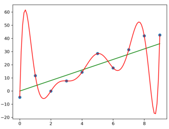
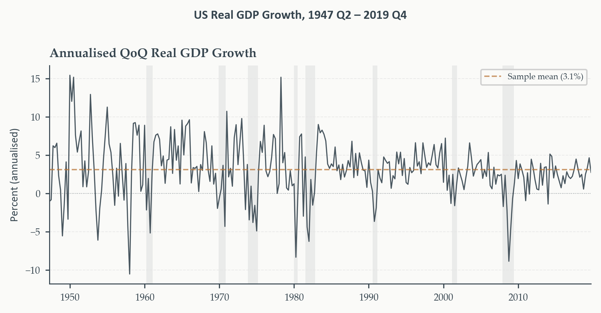
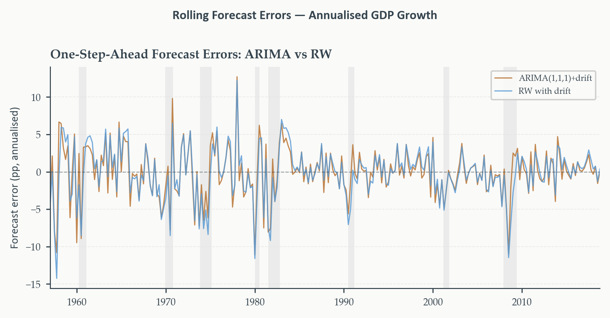
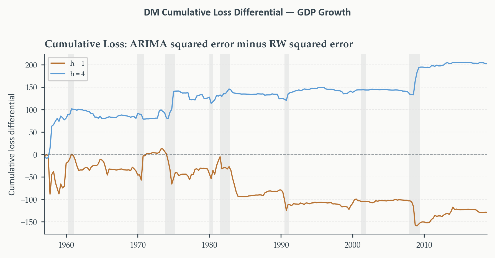
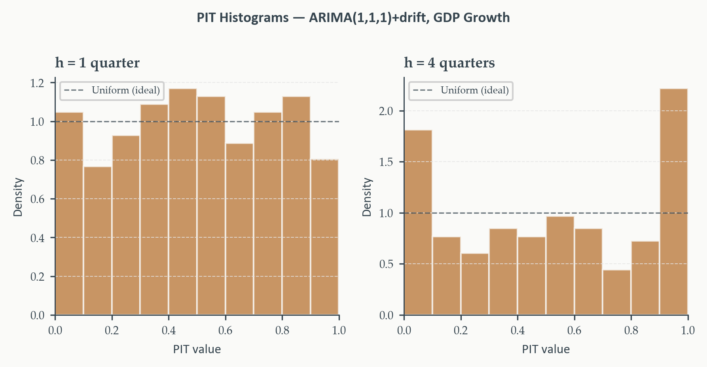

## Building the Model Was Only Half the Job

> Chapters 3 and 4 built a complete toolkit — ARMA, ARIMA, SARIMA — and a principled way to select among specifications using information criteria. A model is fitted, an order is chosen. Are we done?

- Not yet — Chapters 3 and 4 conspicuously left one question open
- Once we have a fitted model and a sequence of forecasts, how do we know whether those forecasts are actually **good**?
- Not "does it fit the data well" — "does it predict data it has never seen"

::: {.eo-recap}
This is not a minor postscript. It's the difference between a model that *describes the past convincingly* and one that's *useful for the future* — and those are not the same property, however good the in-sample diagnostics look.
:::

::: {.notes}
Open here. The framing should feel like a genuine pivot — everything before
this chapter was about building and fitting; this chapter is about whether
any of it was worth building. ~2 min.
:::

---

## Why This Chapter Matters

Two tools, built around one running comparison:

1. **The Diebold-Mariano test** — is an observed accuracy difference between two models distinguishable from sampling noise?
2. **Forecast combination** — can a mixture of models beat any single one? (Answer, with striking regularity: yes)

::: {.eo-recap}
Running example throughout: annualized quarterly US real GDP growth, comparing an **ARIMA(1,1,1) with drift** against the **random walk with drift** — the canonical benchmark serious forecasters are expected to beat before their added complexity earns any credit.
:::

---

## Today's Roadmap {.outline-slide}

1. In-sample fit vs. out-of-sample accuracy
2. Loss functions
3. Out-of-sample evaluation design
4. The Diebold-Mariano test
5. Forecast combination
6. Calibration and predictive distributions

---

## In-Sample Fit vs. Out-of-Sample Accuracy {.section-divider background-color="#B87333" footer=false}

::: {.eo-section-label}
Section 1
:::

---

## Two Different Questions

::: {.eo-definition}
**In-sample fit.** How well a model explains the data it was estimated on — a measure of the model's description of the **past**.

**Out-of-sample forecast accuracy.** How well a model predicts data it has never seen, on a horizon and loss function chosen by the forecaster — a measure of the model's usefulness for the **future**.
:::

A model can excel at one and fail at the other. Nothing about fitting the observed sample well guarantees the pattern generalizes forward.

---

## A Visual Warning

{fig-alt="Noisy roughly linear data fitted with both a linear function and a high-order polynomial; the polynomial fits every point exactly but the linear function is expected to generalize better beyond the data" width="60%"}

*The polynomial is a **perfect** in-sample fit — it passes through every point. The line is not. Extrapolate either beyond the observed data, and the line is expected to generalize far better. Fit and accuracy are not the same axis.*

---

## Don't AIC and BIC Already Solve This?

> Chapters 3 and 4 used AIC and BIC constantly to select model order. Isn't that already protecting against exactly this problem?

::: {.eo-recap}
**Partially — and it's worth being precise about how.** AIC's $2k$ penalty is an approximately unbiased correction for the optimism that comes from using the same data to both estimate and evaluate a model. It's not naive in-sample fit. But "partial" is the operative word — three real gaps remain.
:::

---

## Gap 1: The Wrong Loss Function

> AIC picks the model that best approximates the truth under **log-likelihood**. What if the thing you actually care about is something else — like squared error?

::: {.eo-hazard}
Minimizing AIC doesn't guarantee minimizing MSE, or MAE, or any other loss you actually care about. The AIC-best model and the RMSE-best model can be **different models**.
:::

**A case you've already seen.** Chapter 3's ICSA identification: AIC selected **ARMA(3,3)** — the largest model in the grid — while BIC and HQ both selected the far more parsimonious **ARMA(1,2)**. AIC's flat $2k$ penalty judged the extra six parameters worth their modest likelihood gain; a forecaster targeting RMSE has no guarantee that judgment carries over.

::: {.eo-recap}
Same data, same estimation sample — three criteria, two different answers. That disagreement is real information, not noise to average away.
:::

---

## Gap 2: No Protection Against Structural Change

> AIC is computed entirely on the estimation sample — the past. What can it possibly know about whether the future looks like that past?

::: {.eo-hazard}
Nothing. AIC has no mechanism to detect that the data-generating process itself has shifted. A model that best explains 1980–2010 can be the *wrong* model for 2015–2025 if the underlying economy changed in between — and AIC, computed only on history, would never flag it.
:::

**The intuition, concretely.** Suppose GDP volatility genuinely fell after the mid-1980s (the "Great Moderation," Chapter 1). A model fit on the full 1960–2024 sample, chosen by AIC to fit *that whole span* well, may be a poor description of any single sub-period — best on average, not best for right now.

::: {.eo-recap}
This is precisely Chapter 6's subject: testing whether the process generating the data has actually stayed the same.
:::

---

## Gap 3: Only Compares Within a Family

> AIC ranks ARIMA(2,1,1) against ARIMA(1,1,1) — both from the same family, built the same way. What can it say about a fundamentally different competitor?

::: {.eo-hazard}
Nothing, again — by construction. AIC compares log-likelihoods, and a plain random walk, a judgment-based forecast, or a machine learning model may not even have a comparable likelihood to compute against.
:::

**Why this matters practically.** The single most important benchmark in this chapter — the random walk with drift — has *no AR terms, no MA terms, no structure at all*. AIC was never built to ask "does my carefully-selected ARIMA actually beat doing almost nothing?" That question needs a different tool entirely: direct out-of-sample comparison, on the loss function that matters for the decision at hand.

## What AIC Is Really Minimizing

::: {.eo-definition}
**Kullback-Leibler divergence.** $\text{KL}(f\|\hat f)=\int f(y)\log\frac{f(y)}{\hat f(y)}\,dy$ — how much information is lost approximating the true data-generating process $f$ with the fitted model $\hat f$.
:::

Minimizing AIC is asymptotically equivalent to minimizing expected KL divergence from the truth — a genuine predictive claim, not mere goodness-of-fit. This is exactly *why* AIC corresponds to log-likelihood loss specifically: KL divergence and the logarithmic scoring rule are the same object in different notation.

::: {.eo-recap}
**The upshot for this chapter.** Information criteria are a real, theoretically grounded step toward predictive accuracy — not a placeholder to be discarded. But when the goal is comparing forecast strategies on a specific task, specific loss function, specific horizon, direct out-of-sample evaluation is not optional. That's everything this chapter builds.
:::

---

## Loss Functions {.section-divider background-color="#B87333" footer=false}

::: {.eo-section-label}
Section 2
:::

---

## What Exactly Is a Forecast Error?

Standing at time $t$, forecasting $y$ at $t+h$: the forecast is $\hat y_{t+h|t}$. When $t+h$ arrives:

$$
e_{t+h|t} = y_{t+h}-\hat y_{t+h|t}
$$

::: {.eo-definition}
**Reading the double subscript.** The index **before** the bar, $t+h$, is the **target date** being forecast. The index **after** the bar, $t$, is the **forecast origin** — when the information set closed. $e_{t+4|t}$: the error of a four-quarter-ahead forecast made at $t$. $e_{t+1|t}$: one-quarter-ahead, same origin.
:::

::: {.eo-recap}
This distinction matters because forecasts made further in advance are generally less accurate — evaluate horizons **separately**, never pooled together.
:::

---

## MSE and MAE: Two Different Preferences

$$
\text{MSE} = \frac{1}{n}\sum_t e_{t+h|t}^2, \qquad \text{MAE} = \frac{1}{n}\sum_t|e_{t+h|t}|, \qquad \text{RMSE}=\sqrt{\text{MSE}}
$$

::: {.eo-recap}
**Not just algebra — different underlying preferences.** MSE: an error of 4 contributes 16; an error of 2 contributes 4 — **disproportionate** penalty on large errors. Right when a severe miss causes damage more than proportional to its size. MAE: an error of 4 contributes exactly twice an error of 2 — **proportional** penalty throughout, more robust to outliers.
:::

RMSE returns the loss to the original series' units — the standard reporting metric in macroeconomic forecasting.

---

## The Deeper Consequence: What "Optimal" Means

> Chapter 1 stated, without proof at the time, that squared error loss is minimized by the conditional mean. Now the payoff.

::: {.eo-definition}
**Optimal forecast, by loss function.** Squared error loss $\to$ conditional mean: $\hat y^*_{t+h|t}=\mathbb{E}[y_{t+h}\mid\mathcal{F}_t]$. Absolute error loss $\to$ conditional median.
:::

::: {.eo-hazard}
**The choice of loss function is not neutral.** It implicitly commits you to judging forecasters by how well they approximate the mean — or the median. For symmetric distributions (the Gaussian ARIMA/ARIMA implies), mean and median coincide, and the distinction is moot. For skewed distributions — asset returns, insurance claims, default probabilities — the choice can produce **materially different** optimal forecasts and can even reverse which of two forecasters looks better.
:::

---

## Scale-Free Loss: The MAPE Trap

> MSE and MAE are scale-dependent — a GDP MAE of 0.5pp and an inflation MAE of 0.5pp are comparable, but a GDP MAE can't be compared to a jobless-claims MAE at all. What fixes this?

$$
\text{MAPE} = \frac{1}{n}\sum_t\left|\frac{e_{t+h|t}}{y_{t+h}}\right|\times100
$$

::: {.eo-hazard}
**MAPE is undefined at $y_{t+h}=0$ and explodes near it.** For any series that crosses or approaches zero — GDP growth, interest rate changes, many economic series — MAPE becomes wildly unstable exactly where it matters most. Not a minor footnote; a real reason to avoid it for series like this chapter's GDP growth.
:::

---

## MASE: The Scale-Free Alternative That Works

::: {.eo-definition}
**Mean Absolute Scaled Error.** MAE of the model, scaled by the in-sample MAE of the **naive random walk**:

$$
\text{MASE} = \frac{\text{MAE}}{\frac{1}{n}\sum_t|y_t-y_{t-1}|}
$$
:::

::: {.eo-recap}
**Well-defined for any series** — no division by an outcome that might be zero, since the denominator is a fixed in-sample benchmark quantity. MASE $<1$: the model beats the naive random walk. MASE $>1$: it doesn't. This is our recommended criterion whenever comparing across series with different units or volatility — and it directly encodes this chapter's central benchmark comparison.
:::

---

## Asymmetric Loss: When Errors Aren't Equally Bad

> Every criterion so far treats an overforecast and an underforecast of equal size identically. When is that assumption wrong?

**A central bank** near a 2% inflation target: undershooting (forecast too high, tighten unnecessarily) risks recession; overshooting (forecast too low, fail to tighten) risks an inflation spiral. Not symmetric costs.

**An inventory manager**: underforecasting demand costs stockouts; overforecasting costs excess carrying costs. The ratio varies by product, margin, perishability.

::: {.eo-definition}
**Asymmetric loss.**

$$
\mathcal{L}(e) = \begin{cases}\alpha|e| & e<0\ \text{(overprediction)}\\(1-\alpha)|e| & e\geq0\ \text{(underprediction)}\end{cases}, \qquad \alpha\in(0,1)
$$

$\alpha=0.5$ recovers plain MAE. $\alpha>0.5$: overprediction penalized more. $\alpha<0.5$: underprediction penalized more.
:::

---

## Seeing Where $\alpha$ Enters

Same seven errors as before, now scored three ways — squared, absolute, and asymmetric with $\alpha=0.3$ (overprediction penalized lightly, underprediction penalized heavily):

| Error $e$ | Squared $e^2$ | Absolute $\lvert e\rvert$ | Asymmetric ($\alpha=0.3$) |
|:---:|:---:|:---:|:---:|
| $-4$ | 16.0 | 4.0 | $0.3\times4=1.2$ |
| $-2$ | 4.0 | 2.0 | $0.3\times2=0.6$ |
| $-1$ | 1.0 | 1.0 | $0.3\times1=0.3$ |
| $0$ | 0.0 | 0.0 | 0.0 |
| $1$ | 1.0 | 1.0 | $0.7\times1=0.7$ |
| $2$ | 4.0 | 2.0 | $0.7\times2=1.4$ |
| $4$ | 16.0 | 4.0 | $0.7\times4=2.8$ |

::: {.eo-recap}
**Compare the two directions to each other, not to the absolute column.** At $e=-2$ (overprediction): penalty is $0.3\times2=0.6$. At $e=+2$ (underprediction), same magnitude: penalty is $0.7\times2=1.4$ — **more than double** the overprediction penalty, for an error of identical size. That ratio, $0.7/0.3\approx2.3\times$, is exactly what $\alpha=0.3$ encodes: underpredicting costs $2.3$ times what overpredicting costs, at any error size. It isn't a decoration on the formula — it's the dial that sets that ratio.
:::

---

## The Running Example: GDP Growth

{fig-alt="Annualized quarterly US real GDP growth, 1947 Q2 to 2019 Q4, fluctuating around roughly 3 percent with sharp negative episodes during NBER recessions"}

*Fluctuates around a mean near 3%, with sharp negative dips at every NBER recession and rapid recoveries after. Note the volatility itself — visibly higher pre-1985 than in the Great Moderation era after, a feature the evaluation design in Section 3 has to account for directly.*

::: {.eo-recap}
**A useful sanity benchmark.** A naive forecast that always predicts the sample mean produces RMSE equal to the series' own standard deviation — any real model needs to beat *that* to be worth anything. The harder target, developed through this chapter: beating the random walk with drift, not just the sample mean.
:::

---

## Out-of-Sample Evaluation Design {.section-divider background-color="#B87333" footer=false}

::: {.eo-section-label}
Section 3
:::

---

## The Problem With One Train-Test Split

> Chapter 2 used a simple train-test split to preview evaluation — fit on the first part, forecast the rest, compare. What's structurally wrong with stopping there?

A single split gives **one draw** from a distribution we actually care about. If that period happens to contain an unusual episode — a recession, a policy shift — the number we compute reflects conditions that may not be representative at all.

::: {.eo-recap}
**Unlike cross-sectional statistics, we can't resample the test set.** In time series, the test set is *the future*, and we only observe it once. There's no repeated-draws fix — which makes evaluation *design* itself, not just evaluation *arithmetic*, the real discipline this section builds.
:::

---

## Look-Ahead Bias: The Deeper Problem

> The clearest failure: fitting a model on the full sample, then claiming to "test" it on part of that same sample. But look-ahead bias is sneakier than that single obvious case.

::: {.eo-hazard}
**Three forms, not one.**

**Direct** — estimating on the full sample, evaluating on a subsample already inside it.

**Indirect** — using the full sample to *select* the model (ARIMA order, whether to include a trend, window length), then evaluating on a hold-out. Selection already consumed test-set information.

**Data-processing** — the *data itself* is constructed using out-of-sample information, before forecasting even begins. Example: Chapter 2's seasonal adjustment (X-13, STL) estimates seasonal factors from the *whole* sample — every value in the adjusted series has already absorbed information from its own future.
:::

::: {.eo-recap}
**One fix for all three.** Treat the evaluation period as strictly out of bounds during *every* step of model construction — not just estimation. A forecast made at time $t$ uses only information available at time $t$, full stop.
:::

---

## Pseudo-Real-Time Evaluation

The fix: simulate what a forecaster genuinely would have done at each point in the evaluation period. Fix a horizon $h$ and a training window; step through one observation at a time, re-estimating and forecasting at each step.

::: {.eo-recap}
The result is a sequence of errors generated under the same discipline a real forecaster faces — no future data, no benefit of hindsight, ever.
:::

Two schemes for how the training window updates as we step forward.

---

## Rolling vs. Recursive Windows

| | Rolling window | Recursive window |
|:---|:---|:---|
| Window length | Fixed at $W$ | Grows each step |
| Oldest obs. used | $t-W+1$ | Always period 1 |
| Adapts to change | Yes — drops old data | Slowly — retains all |
| Parameter precision | Lower (fewer obs.) | Higher (more obs.) |
| Best when | Process may be unstable | Process is stable |

::: {.eo-recap}
**Run both — the gap between them is itself informative.** If rolling substantially outperforms recursive, that's evidence the process has changed over the sample, and recent data are more relevant than old data. Chapter 6 develops formal tests for exactly this kind of instability.
:::

---

## Choosing Horizon and Window Length

**Horizon** should match the actual decision. A central bank watching the next policy meeting cares about $h=1$–$2$; a fiscal authority planning multi-year budgets cares about $h=8$ or longer. Academic convention: $h\in\{1,2,4,8\}$ quarters, reported **separately**, never averaged across horizons.

**Window length** is a bias-variance tradeoff. Short: adapts fast, noisy estimates. Long: precise estimates, slow to update.

::: {.eo-recap}
**This chapter's choice: $W=40$ quarters (10 years), $h\in\{1,4\}$.** Long enough for stable ARIMA estimation; short enough to actually track the Great Moderation's volatility shift within the window rather than averaging over it.
:::

---

## Applied: The Evaluation Loop

At each origin $t$: slice the 40-quarter training window, fit **ARIMA(1,1,1) with drift** and the **random walk with drift**, forecast $h=1$ and $h=4$ quarters ahead, store both errors — one pass, both models, both horizons together.

::: {.eo-definition}
**The random walk with drift benchmark**, precisely: next quarter's growth = the average growth rate over the training window. No AR terms, no MA terms, no dynamic structure whatsoever.
:::

::: {.eo-hazard}
**A deceptively strong benchmark.** Meese and Rogoff (1983) on exchange rates, Stock and Watson (2003) on US output growth — decades of research document this atheoretical benchmark is extraordinarily hard to beat, especially at short horizons. The ARIMA has three estimated parameters and a carefully chosen lag structure; beating a benchmark with *zero* structure is a genuinely harder test than it sounds.
:::

---

## Applied: The Result

::: {.eo-recap}
**The ARIMA edges ahead at $h=1$ — but trails at $h=4$.** In neither case is the margin large. The random walk with drift, doing essentially nothing sophisticated, is competitive with a carefully specified ARIMA at both horizons.
:::

Is either difference actually distinguishable from sampling noise, or could it have arisen by chance in this particular 40-quarter-rolling evaluation? That's exactly the question Section 4's formal test answers — an RMSE table alone can't.

---

## Where the Errors Cluster

{fig-alt="Rolling one-step-ahead forecast errors for the ARIMA(1,1,1) with drift and the random walk with drift, annualized GDP growth, with large errors clustering around NBER recessions"}

*Both models' errors center near zero — but large errors cluster tightly around every NBER recession (shaded), reflecting how hard turning points are to forecast for either approach. The real question isn't whether either model errs during recessions — both do — it's whether the ARIMA's errors are **systematically smaller** across the full evaluation window.*

::: {.notes}
This figure sets up Section 4 directly — the clustering pattern is exactly
why the DM test needs a long-run variance correction rather than a naive
t-test on the mean loss differential. ~1-2 min.
:::

---

## The Diebold-Mariano Test {.section-divider background-color="#B87333" footer=false}

::: {.eo-section-label}
Section 4
:::

---

## An RMSE Table Isn't Enough

> Section 3's table said the ARIMA edged ahead at $h=1$ and trailed at $h=4$. Is either difference *real*, or could it have appeared by chance in this particular 40-quarter window?

Even if two models had **identical** expected accuracy, one would look better than the other in any given finite sample, purely by luck.

::: {.eo-recap}
**Diebold and Mariano (1995)** answers this directly — a formal hypothesis test for equal predictive accuracy. Its appeal is generality: works for *any* loss function, makes no assumption about the models' parametric form, doesn't require normal errors.
:::

---

## The Loss Differential

For each forecast origin $t$, compute each model's loss and take the difference:

$$
d_t = \mathcal{L}(e_{1,t+h|t})-\mathcal{L}(e_{2,t+h|t})
$$

Under squared error loss: $d_t=e_{1,t+h|t}^2-e_{2,t+h|t}^2$. Positive when model 1 incurred greater loss; negative when model 1 was more accurate.

::: {.eo-definition}
**Null hypothesis: equal predictive accuracy.** $H_0:\mathbb{E}[d_t]=0$. If model 1 is genuinely better, $\bar d=n^{-1}\sum_td_t$ should be negative and large. The DM test asks: is it large *enough*?
:::

---

## Why a Standard $t$-Test Doesn't Work

> If $\{d_t\}$ were serially uncorrelated, an ordinary $t$-test on $\bar d$ would suffice. Why doesn't it apply here?

For an $h$-step forecast, $e_{t+h|t}$ is driven by innovations $\varepsilon_{t+1},\ldots,\varepsilon_{t+h}$. The **next** error, $e_{t+h+1|t+1}$, is driven by $\varepsilon_{t+2},\ldots,\varepsilon_{t+h+1}$.

::: {.eo-hazard}
**These two errors share $h-1$ innovations.** They're correlated — and so are their squares. The loss differentials $d_t$ are serially correlated **of order at least $h-1$**, even when both models are correctly specified. A standard $t$-test would produce standard errors that are too small — and reject the null far too often.
:::

---

## The Long-Run Variance Correction

Replace the ordinary variance of $\bar d$ with a **long-run variance** — summing *all* autocovariances of $d_t$, not just lag zero:

$$
\widehat V(\bar d) = \frac{1}{n}\left(\hat\gamma_0+2\sum_{k=1}^K w_k\hat\gamma_k\right), \qquad \hat\gamma_k=\frac{1}{n}\sum_t(d_t-\bar d)(d_{t-k}-\bar d)
$$

::: {.eo-definition}
**Newey-West (Bartlett) weights.** $w_k=1-k/(K+1)$, downweighting distant lags — guarantees a positive variance estimate. Standard bandwidth: $K=h-1$ or a small multiple.
:::

---

## The DM Statistic

$$
\text{DM} = \frac{\bar d}{\sqrt{\widehat V(\bar d)}}
$$

::: {.eo-recap}
**Asymptotically $N(0,1)$ under $H_0$** and standard regularity conditions. Compare against $\pm1.96$ for a 5% two-sided test, or $-1.645$ for a one-sided test that model 1 is superior ($\bar d<0$).
:::

::: {.eo-hazard}
**One estimation-uncertainty caveat.** When forecasts come from estimated (not known) parameters, West (1996) shows the $N(0,1)$ approximation can be affected by parameter estimation uncertainty. Reliable for large evaluation samples; some caution warranted for short windows.
:::

---

## Applied: ARIMA vs. Random Walk

::: {.eo-recap}
**Neither horizon rejects at 5%.** DM $\approx-0.80$ at $h=1$ (negative — ARIMA has lower average loss, but not distinguishably so); a smaller-magnitude, opposite-signed statistic at $h=4$. Both fail to reject equal predictive accuracy.
:::

The RMSE table's apparent edge for ARIMA at $h=1$ **does not survive** formal testing — it's consistent with noise, not a demonstrated structural advantage.

---

## Watching the Loss Differential Accumulate

{fig-alt="Cumulative loss differential between ARIMA and random walk squared errors at horizons h=1 and h=4, showing a mild downward drift at h=1 and an upward drift at h=4 with recessions widening the gap"}

*At $h=1$ (copper): mild downward drift on net — consistent with the negative DM statistic, but no sharp directional break. At $h=4$ (sky blue): upward trend — the random walk's advantage accumulating, widening sharply during recessions. The ARIMA's four-step forecasts struggle specifically around turning points.*

---

## What DM Does and Doesn't Tell You

::: {.eo-hazard}
**A comparison tool, not a selection rule.** A rejection says one model had systematically lower loss **during this particular evaluation window**. It does **not** tell you:

- Which model will be more accurate next period
- Whether the difference reflects genuine structural advantage or a fortunate draw
- Whether the winning model is well-specified at all
:::

::: {.eo-recap}
Use DM to ask whether an observed accuracy difference is distinguishable from noise — nothing more, nothing less.
:::

---

## Forecast Combination {.section-divider background-color="#B87333" footer=false}

::: {.eo-section-label}
Section 5
:::

---

## Once You Know Which Model Is Better, Just Use It?

> Section 4 answers a binary question: does one model beat another? The natural next move — use the winner, discard the loser. Is that actually the right call?

Often, no. Combining forecasts — even from models that differ substantially in accuracy — frequently **beats** the best individual model alone.

::: {.eo-recap}
**Portfolio diversification, in disguise.** An investor holding only the single highest-expected-return asset ignores idiosyncratic risk — the chance that yesterday's best performer underperforms tomorrow for reasons specific to it. Diversifying reduces that risk even at some cost to expected return. Each forecasting model captures some features of the process and misses others; combining averages out their *idiosyncratic* errors.
:::

---

## The Second Motivation: Model Uncertainty

> We're never actually sure which model is the true data-generating process. Section 4 established the DM test tells us who won in this window — not necessarily who wins next time.

::: {.eo-recap}
**Combination hedges across models rather than committing to one** — analogous to Bayesian model averaging, but simple and robust, with no need to specify prior probabilities over the model space.
:::

---

## Setting Up the Combined Forecast

$$
\hat y^{(c)}_{t+h|t} = \omega\,\hat y^{(1)}_{t+h|t}+(1-\omega)\,\hat y^{(2)}_{t+h|t}
$$

Combination error: $e^{(c)}=\omega e^{(1)}+(1-\omega)e^{(2)}$. Its variance:

$$
\text{Var}(e^{(c)}) = \omega^2\sigma_1^2+(1-\omega)^2\sigma_2^2+2\omega(1-\omega)\sigma_{12}
$$

where $\sigma_1^2,\sigma_2^2$ are each model's error variance and $\sigma_{12}$ their covariance.

---

## The Bates-Granger Optimal Weight

Minimizing the combined variance over $\omega$ — differentiate, set to zero:

$$
\omega^* = \frac{\sigma_2^2-\sigma_{12}}{\sigma_1^2+\sigma_2^2-2\sigma_{12}}
$$

::: {.eo-recap}
**Reading the formula.** Weight on model 1 rises when model 2's variance is high, falls when model 1's variance is high — exactly what intuition suggests. When $\sigma_{12}=0$: $\omega^*=\sigma_2^2/(\sigma_1^2+\sigma_2^2)$ — inverse-variance weighting, more accurate models get more weight. When $\sigma_1^2=\sigma_2^2$ and $\sigma_{12}=0$: $\omega^*=1/2$, exactly equal weighting.
:::

---

## The Forecast Combination Puzzle

> $\omega^*$ must be *estimated* from the same evaluation sample that produced the error sequences. What does that estimation itself cost?

::: {.eo-hazard}
**Estimation noise in $\omega^*$ can degrade performance — sometimes badly — with short evaluation windows.** This is exactly why simple **equal-weight combination** ($\omega=0.5$) is often competitive with, or beats, the theoretically optimal weight. Well-documented enough to have its own name: the **forecast combination puzzle** — equal weights outperforming estimated-optimal weights, because equal weighting sidesteps $\omega^*$'s estimation error entirely.
:::

::: {.eo-definition}
**OLS combination**, the third option: regress $y_{t+h}$ on both $\hat y^{(1)}_{t+h|t}$ and $\hat y^{(2)}_{t+h|t}$. Allows biased individual forecasts and general correlation structure — costs two evaluation-sample degrees of freedom in exchange for that flexibility.
:::

---

## When to Combine, When to Select

::: {.eo-recap}
**Combine when**: the DM test fails to reject (models are comparably accurate); the cumulative loss differential shows reversals (advantages are regime-dependent — exactly what Section 4's figure showed); the models draw on genuinely different information.

**Select when**: one model dominates persistently and by a large margin across every evaluation subperiod — combining in a much weaker model dilutes rather than removes its errors, and the bias that introduces may not be worth the variance reduction.
:::

---

## Applied: Combination at Both Horizons

RMSE ratio vs. the random walk benchmark (values below 1 beat the benchmark). For Bates-Granger, $\omega$ is the weight on **ARIMA** — $(1-\omega)$ goes to the random walk:

| Strategy | $h=1$ | $h=4$ |
|:---|:---:|:---:|
| ARIMA alone | 0.978 | 1.033 |
| Bates-Granger ($\omega$) | below 1 ($\omega=0.65$) | 1.011 ($\omega=0.00$) |
| **OLS combination** | **0.953** | **0.972** |

::: {.eo-recap}
**The reversal is the whole story.** At $h=1$, Bates-Granger keeps most of its weight on ARIMA ($\omega=0.65$) because ARIMA is genuinely more accurate there. At $h=4$, that weight **collapses to $\omega=0.00$** — the evaluation sample gives ARIMA nothing. Equal weights ($\omega$ fixed at 0.5, not shown) can't adapt to this and underperforms at $h=4$ regardless. Only OLS beats the benchmark at **both** horizons, by implicitly downweighting whichever model is currently weaker rather than averaging blindly.
:::

---

## Calibration and Predictive Distributions {.section-divider background-color="#B87333" footer=false}

::: {.eo-section-label}
Section 6
:::

---

## The Question We've Never Asked

> Chapters 3 and 4 built prediction intervals and fan charts; the interval widens with horizon, exactly as it should. But does the true value actually fall inside that stated band as often as the "95%" label promises?

::: {.eo-definition}
**Coverage.** Over $n$ forecast origins, the fraction of times the outcome fell inside the stated interval:

$$
\widehat{\text{coverage}} = \frac{1}{n}\sum_t\mathbf{1}\{y_{t+h}\in[\hat y^L_{t+h|t},\hat y^U_{t+h|t}]\}
$$
:::

::: {.eo-recap}
Below nominal: intervals **too narrow**, uncertainty understated. Above nominal: intervals **too wide**, unnecessarily cautious. Coverage requires no new estimation — the interval bounds were already stored in Section 3's evaluation loop.
:::

---

## Applied: Coverage of the ARIMA Intervals

| Interval | Nominal | $h=1$ | $h=4$ |
|:---|:---:|:---:|:---:|
| 90% | 0.90 | 0.879 | 0.706 |
| 95% | 0.95 | 0.931 | 0.794 |

::: {.eo-recap}
**At $h=1$: modest undercoverage** — small enough to tolerate for most research purposes. **At $h=4$: severe** — a stated 95% interval capturing the outcome barely 4 times in 5 is not a 95% interval in any practical sense. Same root cause both times: Gaussian, constant-variance innovations underestimate true uncertainty, and that gap compounds with horizon.
:::

---

## Beyond a Single Interval: The PIT

> Coverage checks one specific pair of quantiles — the stated interval's edges. What about the **entire** predictive distribution — could it be miscalibrated everywhere else, even with correct coverage at 95%?

::: {.eo-definition}
**Probability integral transform.** If the predictive CDF $F_{t+h|t}$ is correctly specified, $z_t=F_{t+h|t}(y_{t+h})$ is uniformly distributed on $[0,1]$ — by definition of what "correct distribution" means. For Gaussian ARIMA forecasts: $z_t=\Phi\!\left(\frac{y_{t+h}-\hat y_{t+h|t}}{\hat\sigma_{t+h|t}}\right)$.
:::

Collect $\{z_t\}$ across the evaluation window, plot a histogram. A well-calibrated model produces something **approximately flat**.

---

## Reading the Shape of Miscalibration

::: {.eo-recap}
**U-shaped** — mass piles at 0 and 1, thin in the middle: intervals **too narrow**, the model is surprised more often than it should be. **Hump-shaped** — mass concentrates near 0.5: intervals **too wide**, outcomes cluster tighter than the model claims. **Skewed** — mass tilts to one side: the point forecast itself is **systematically biased**, not just imprecise.
:::

Three shapes, three distinct diagnoses — from a single histogram, no additional model fitting required.

---

## Applied: PIT at $h=1$ vs. $h=4$

{fig-alt="PIT histograms for the ARIMA(1,1,1) with drift at h=1 and h=4, showing an approximately flat histogram at h=1 and a pronounced J-shape with a spike near 1 at h=4"}

*Left ($h=1$): roughly flat — consistent with the mild undercoverage already found. Right ($h=4$): a pronounced **J-shape**, heavy mass at both ends, spike concentrated near 1. Two problems at once — the distribution is too narrow (matching severe undercoverage) **and** systematically biased toward underpredicting growth (the spike near 1 means actual growth lands in the model's upper tail far more often than it should).*

::: {.notes}
The right-tail spike is the striking result — worth pointing out explicitly.
At h=4 the ARIMA isn't just imprecise, it's biased low. Both problems trace
to estimating on a sample spanning the volatile pre-1985 period and the
calmer Great Moderation — foreshadows Chapter 6 directly. ~2 min.
:::

---

## CRPS: A Single-Number Extension

::: {.eo-definition}
**Continuous ranked probability score.**

$$
\text{CRPS}_t = \int_{-\infty}^{\infty}\big[F_{t+h|t}(y)-\mathbf{1}\{y\geq y_{t+h}\}\big]^2\,dy
$$
:::

A spike exactly at the true outcome scores zero; a diffuse distribution scores higher, even when the true value falls comfortably inside it. Rewards **both** calibration and sharpness simultaneously — a single number combining what coverage and PIT check separately.

::: {.eo-recap}
This course uses PIT as the primary calibration diagnostic; CRPS is the natural next step wherever the full predictive distribution is the actual object of interest — energy trading, weather forecasting, risk management.
:::

---

## Recap {.recap-slide background-color="#87A96B" footer=false}

We built the complete forecast evaluation workflow. In-sample fit and out-of-sample accuracy are genuinely different properties — AIC gets us partway to predictive accuracy but leaves three real gaps open. Loss functions encode substantive preferences, not neutral defaults — MSE, MAE, MASE, and asymmetric loss each imply a different notion of "optimal." Evaluation design — look-ahead bias, rolling windows, horizon choice — is where honest out-of-sample testing actually happens. The Diebold-Mariano test formalized whether an observed accuracy gap is distinguishable from noise; forecast combination showed that averaging competing models, even unequal ones, routinely beats either alone. And calibration — coverage, the PIT — asked the question prediction intervals never answer on their own: are the stated probabilities actually correct?

::: {.eo-recap}
Every diagnostic in this chapter pointed the same direction: the ARIMA's advantage over the random walk vanishes at longer horizons, and its intervals grow severely miscalibrated exactly where the sample crosses from the volatile pre-1985 era into the calmer Great Moderation.
:::

---

## Looking Ahead

This chapter completed the core forecasting workflow — building a model (Chapters 3–4) and knowing whether to trust its forecasts (this chapter). The toolkit is portable: it applies to any model class, any loss function, any series.

But the empirical results leave an open question. The ARIMA's advantage over the random walk disappeared at $h=4$; the rolling error plot showed both models' errors clustering around recessions in a way that looks structural, not random. This raises a natural suspicion: **the data-generating process may not be stable over the sample.**

Chapter 6 addresses this directly — formal tests for structural breaks, and what to do once one is found.

---

## Key Terms

::: {.eo-keyterms}
In-sample fit / Out-of-sample accuracy
: How well a model explains its own estimation data vs. how well it predicts data it has never seen.

Loss function / MSE, MAE, RMSE, MASE
: Encodes forecast-error preferences; squared loss optimal forecast is the conditional mean, absolute loss the conditional median. MASE scales by the naive random-walk benchmark, avoiding MAPE's zero-division failure.

Look-ahead bias
: Direct (testing inside the training sample), indirect (model selection informed by the test period), or data-processing (the data itself built using out-of-sample information).

Rolling / Recursive window
: Fixed-length vs. ever-growing training window as the forecast origin steps forward; the gap between them is itself diagnostic of instability.

Diebold-Mariano test
: Tests $H_0:\mathbb{E}[d_t]=0$ for the loss differential $d_t$, using a long-run (Newey-West) variance to correct for the serial correlation inherent in multi-step forecast errors.

Long-run variance / Newey-West estimator
: Sum of all autocovariances of a stationary process; HAC estimator using Bartlett weights, guarantees a positive variance estimate.

Forecast combination / Bates-Granger weight
: A weighted average of competing forecasts; the variance-minimizing weight $\omega^*$ depends on both models' error variances and their covariance.

Forecast combination puzzle
: Equal weights often match or beat the theoretically optimal weight, because estimating $\omega^*$ introduces its own noise.

Coverage
: The empirical fraction of outcomes falling inside a stated prediction interval; should equal the nominal level for a well-calibrated model.

Probability integral transform (PIT)
: $z_t=F_{t+h|t}(y_{t+h})$; uniform on $[0,1]$ under correct specification. U-shaped, hump-shaped, and skewed departures each diagnose a specific miscalibration.

CRPS
: A proper scoring rule rewarding both calibration and sharpness of a full predictive distribution in one number.
:::
